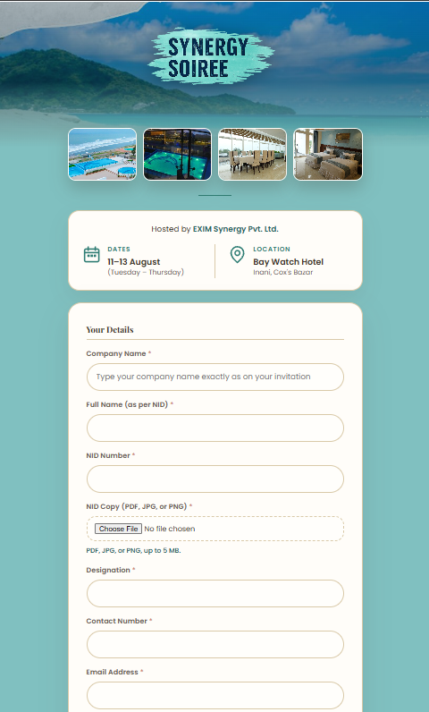
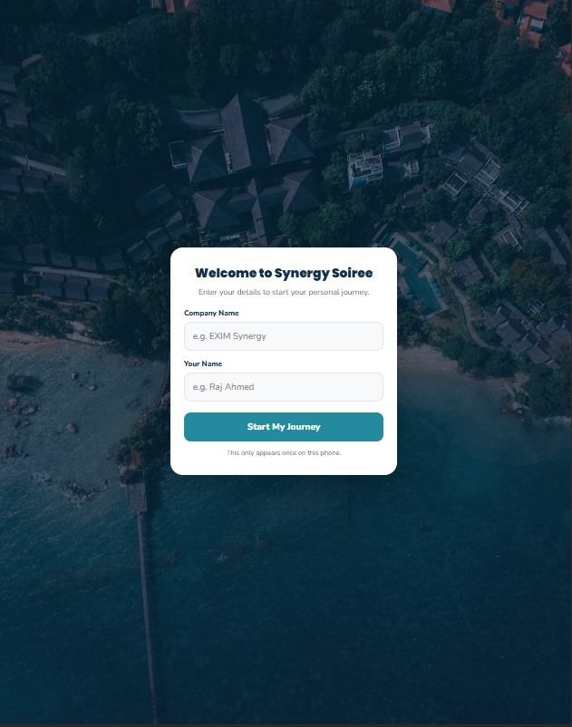
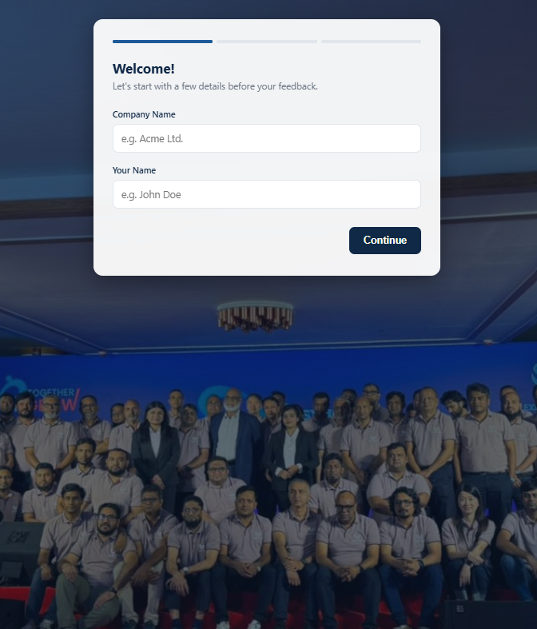

# 🎉 Synergy Soiree – Event Management Suite


A lightweight, zero-cost event management system built for **Synergy Soiree**, a corporate networking event with ~70 invited guests. It covers the full guest journey, **registration → check-in → feedback**, using three Google Apps Script web apps backed by Google Sheets and Google Drive.

| 👥 Guests | 🧩 Apps | 💰 Hosting cost |
|:---:|:---:|:---:|
| ~70 | 3 | $0 |

No servers, no hosting fees, no database setup. Everything runs on Google Workspace.

---

## ✨ Highlights

- **Company-based seat quotas.** Invitations were issued per company (1–3 seats each). The registration app enforces each company's limit automatically, so no company can go over its allotted seats.
- **QR-powered check-in.** Guests scan a QR code at the venue and get a personal itinerary for the event, where they can mark each activity as done.
- **Post-event feedback with photo uploads.** Guests can submit feedback and upload their event photos, which are saved straight to Google Drive.
- **Everything lands in Google Sheets**, so organizers can monitor registrations and check-ins live without any extra tools.

---

## 📸 Screenshots

<table>
  <tr>
    <td align="center"><b>Registration</b></td>
    <td align="center"><b>QR Check-in</b></td>
    <td align="center"><b>Feedback</b></td>
  </tr>
  <tr>
    <td></td>
    <td></td>
    <td></td>
  </tr>
</table>

---

## 🧩 The Three Apps

### 1. Registration (`/registration`)
A branded registration page showing the event details (dates, venue, host) followed by the guest form:
- **Company name**, matched against the invitation list to enforce each company's seat quota
- Full name (as per NID), NID number, and **NID copy upload** (PDF/JPG/PNG, max 5 MB, saved to Google Drive)
- Designation, contact number, and email
- T-shirt size and food preference

### 2. QR Check-in (`/qr-checkin`)
Guests scan a QR code at the venue and enter their company and name **once**. The app remembers them on that phone. They then get a personal, step-by-step itinerary and can mark each activity as done.

### 3. Feedback (`/feedback`)
A clean **3-step feedback wizard** (guest details → feedback → photos). Guests can upload their event photos, which go straight to a shared Google Drive folder.

---

## 🛠️ Tech Stack

| Layer | Technology |
|-------|-----------|
| Backend | Google Apps Script (`Code.gs`) |
| Frontend | HTML, CSS, JavaScript (`Index.html`, served via `HtmlService`) |
| Database | Google Sheets |
| File storage | Google Drive |
| Hosting | Apps Script Web App deployments |

---

## 📁 Project Structure

```
synergy-soiree/
├── docs/
│   └── screenshots/
│       ├── registration.png
│       ├── checkin.png
│       └── feedback.png
├── registration/
│   ├── Code.gs
│   ├── Index.html
│   └── appsscript.json
├── qr-checkin/
│   ├── Code.gs
│   └── Index.html
├── feedback/
│   ├── Code.gs
│   └── Index.html
├── .gitignore
└── README.md
```

---

## 🚀 Setup (to run your own copy)

Repeat these steps for each of the three apps:

1. Create a new **Google Sheet** (this will hold the app's data).
2. In the Sheet, go to **Extensions → Apps Script**.
3. Replace the default `Code.gs` content with the `Code.gs` from this repo's folder.
4. Click **+ → HTML**, name the file `Index`, and paste in `Index.html`.
5. For **registration** only: enable **Project Settings → Show "appsscript.json"** and replace its contents with this repo's `appsscript.json`.
6. In `Code.gs`, replace the placeholder values (Sheet IDs / Drive folder IDs) with your own.
7. Click **Deploy → New deployment → Web app**:
   - *Execute as:* **Me**
   - *Who has access:* **Anyone**
8. Authorize the permissions when prompted, then open the Web App URL.

---

## 🔒 Privacy Note

The registration app collects phone numbers, email addresses, and national ID details and images. In this repository, **all real Sheet IDs, Drive folder IDs, and guest data have been removed**, and faces in screenshots have been blurred. If you deploy your own copy, store uploads in a Drive folder with restricted sharing and delete personal data once the event is over.

---

## 👤 Author

**RAJ ROHIT NATH**: [GitHub](https://github.com/raj-rohit-nath) · [LinkedIn](https://www.linkedin.com/in/raj-rohit-nath-5b8735218/)